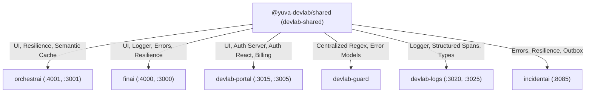

# DevLab Shared — Master Product Specification, Technical Dossier & Operations Manual

---

## 1. Product File: Strategic Vision & Architectural Foundations

### 1.1 Executive Product Summary

**DevLab Shared** (`@yuva-devlab/*`) is the foundational architectural backbone and shared design system powering the entire DevLab multi-repo ecosystem (`orchestrai`, `finai`, `devlab-portal`, `devlab-guard`, `devlab-logs`, `incidentai`).

In enterprise microservice and multi-agent platforms, code duplication, inconsistent UI paradigms, fragmented error hierarchies, divergent logging formats, and bespoke authentication guards quickly lead to platform fragility and maintenance overhead. DevLab Shared solves this by centralizing:

1. **Unified Design System & UI Primitives**: Accessible, themeable UI components built on React 19, Radix UI, Tailwind CSS v4, and standardized design tokens.
2. **Enterprise Primitives & Zero-Dependency Contracts**: Centralized error hierarchies, type-safe configurations, structured Pino logging with credential redaction, and centralized regular expressions.
3. **Distributed Resilience & Security Utilities**: Production-grade Circuit Breakers, Exponential Backoff policies with jitter, Fastify/NestJS authentication guards, and JWKS token verification.
4. **Cognitive Agent & RAG Primitives**: Shared semantic caching (`@yuva-devlab/semantic-cache`), AI client abstractions, vector search interfaces, and token billing calculators.

### 1.2 Target Personas & Primary Use Cases

| Persona                                    | Operational Context                                                         | Primary Pain Points Addressed                                                                                                           |
| :----------------------------------------- | :-------------------------------------------------------------------------- | :-------------------------------------------------------------------------------------------------------------------------------------- |
| **Frontend Engineer**                      | Building user interfaces in OrchestrAI Console, FinAI Web, or DevLab Portal | Eliminates UI drift and CSS conflicts; provides accessible, dark-mode native components with zero styling boilerplate.                  |
| **Backend & Distributed Systems Engineer** | Developing Fastify/NestJS APIs, BullMQ workers, and background daemons      | Provides unified structured logging, standard error codes, resilient retry/circuit breaker policies, and instant JWT validation.        |
| **AI / Machine Learning Engineer**         | Integrating LLM providers and building agent workflows                      | Provides unified multi-provider abstractions, embeddings-based semantic caching, and token usage tracking across all services.          |
| **Platform Maintainer & DevOps**           | Enforcing ecosystem-wide code quality and consistency                       | Provides centralized ESLint, Prettier, and TypeScript configurations, automated Changeset releases, and zero-leak credential redaction. |

---

## 2. Exhaustive Feature Directory & Technical Mechanics

```
┌────────────────────────────────────────────────────────────────────────────────────────────────────────┐
│                               DEVLAB SHARED ARCHITECTURAL LAYERS                                       │
└────────────────────────────────────────────────────────────────────────────────────────────────────────┘
                  [Apps: UI Docs Showcase (:3006) | Storybook (:6006)]
                                     │
    ┌────────────────────────────────┼────────────────────────────────┬──────────────────────────┐
    ▼                                ▼                                ▼                          ▼
[Layer 1: Design & UI]   [Layer 2: Core Primitives]     [Layer 3: Resilience & Auth] [Layer 4: AI Primitives]
 • @yuva-devlab/tokens    • @yuva-devlab/errors          • @yuva-devlab/resilience    • @yuva-devlab/semantic-cache
 • @yuva-devlab/ui        • @yuva-devlab/logger          • @yuva-devlab/auth-server   • @yuva-devlab/agent-core
 • @yuva-devlab/config    • @yuva-devlab/regex           • @yuva-devlab/auth-react    • @yuva-devlab/ai-client
 • Tooling Configs        • @yuva-devlab/events          • @yuva-devlab/billing       • @yuva-devlab/rag
```

### 2.1 Application Layer Breakdown

#### 1. UI Documentation Showcase (`apps/ui-docs` — Port `3006`)

- **Technology Stack**: Next.js 15, React 19, Tailwind CSS v4, `@yuva-devlab/ui`.
- **Purpose**: Live interactive documentation portal showcasing all UI components, tokens, accessibility guidelines, and code snippets.
- **Detailed Features**:
  - **Live Component Sandbox**: Interactive playground for rendering and configuring UI components with real-time prop tweaking.
  - **Color Palette & Token Inspector**: Displays semantic color tokens, typography scales, spacing grids, and elevation shadows.
  - **Code Export & Snippets**: One-click copying of JSX snippets for seamless integration into consumer apps.

#### 2. Storybook Showcase (`apps/ui-storybook` — Port `6006`)

- **Technology Stack**: Storybook v8, Vite, React 19.
- **Purpose**: Isolated component testing and visual regression environment.
- **Detailed Features**:
  - **Component State Matrix**: Renders every component in all permutations (Default, Hover, Disabled, Loading, Error, Dark Mode).
  - **Accessibility (a11y) Audits**: Automated WCAG 2.1 AA compliance checks on every story.

---

### 2.2 Exhaustive Package Catalog (All 20 Packages)

#### Layer 1: Design System & User Interface

1. **`@yuva-devlab/tokens`**:
   - Houses design tokens (colors, typography, spacing, shadows, border radii, z-indices).
   - Generates CSS variables, Tailwind configuration presets, and TypeScript constants.
2. **`@yuva-devlab/ui`**:
   - Comprehensive React 19 component library built on Radix UI primitives.
   - Includes: `Button`, `Dialog`, `Drawer`, `DropdownMenu`, `Input`, `Select`, `Table`, `Tabs`, `Toast`, `Tooltip`, `Card`, `Badge`, `Skeleton`.
   - 100% keyboard navigable and WCAG 2.1 AA accessible.

#### Layer 2: Core Contracts & Runtime Primitives

3. **`@yuva-devlab/errors`**:
   - Unified error hierarchy extending base `AppError`.
   - Implements `NotFoundError`, `UnauthorizedError`, `ForbiddenError`, `ValidationError`, `RateLimitError`, `ConflictError`, `InternalServerError`.
   - Serializes error payloads to RFC 7807 Problem Details JSON.
4. **`@yuva-devlab/logger`**:
   - Structured JSON logging built on Pino with sub-microsecond overhead.
   - Automatic redaction of sensitive credentials (`authorization`, `api_key`, `password`, `credit_card`).
   - Injects OpenTelemetry `traceId` and `spanId` into every log line.
5. **`@yuva-devlab/config`**:
   - Type-safe environment variable parsing and validation using Zod.
   - Masks sensitive environment variables in debug logs.
6. **`@yuva-devlab/regex`**:
   - Centralized repository of regular expressions for the entire ecosystem.
   - Eliminates inline regexes; contains tested expressions for UUIDs, emails, semver, URLs, tokens, and markdown parsing.
7. **`@yuva-devlab/events`**:
   - Typed event bus interfaces, CloudEvents-compliant message wrappers, and transactional outbox persistence helpers.

#### Layer 3: Resilience, Authentication & Billing

8. **`@yuva-devlab/resilience`**:
   - Distributed system fault tolerance primitives:
     - **Circuit Breaker**: Detects downstream failure spikes and transitions between CLOSED, OPEN, and HALF_OPEN states.
     - **Retry with Jitter**: Exponential backoff with full jitter to avoid thundering herd issues.
     - **Bulkhead**: Concurrency isolation limiting concurrent executions per resource.
9. **`@yuva-devlab/auth-server`**:
   - Fastify and NestJS middleware guards for JWT validation, Redis session lookups, and JWKS public key rotation.
10. **`@yuva-devlab/auth-react`**:
    - React context and hooks (`useAuth`, `useUser`, `useTenant`, `usePermission`) for Next.js frontend applications.
11. **`@yuva-devlab/billing`**:
    - Usage metering, token credit calculation, and subscription tier entitlement enforcement models.

#### Layer 4: AI & Cognitive Agent Foundations

12. **`@yuva-devlab/semantic-cache`**:
    - Embeddings-based caching engine. Computes vector embeddings of incoming prompts; returns cached responses if cosine similarity exceeds threshold (default: 0.96).
13. **`@yuva-devlab/agent-core`**:
    - Abstract base contracts for agent state, tool execution interfaces, and cognitive memory adapters.
14. **`@yuva-devlab/ai-client`**:
    - Multi-provider LLM abstraction wrapping Ollama, Anthropic, OpenAI, and DeepSeek with unified streaming and structured JSON output.
15. **`@yuva-devlab/rag`**:
    - Shared vector retrieval primitives, chunking utilities, and reciprocal rank fusion algorithms.

#### Layer 5: Developer Tooling & Shared Configurations

16. **`@yuva-devlab/cli`**: Operational developer CLI for code generation and workspace scaffolding.
17. **`@yuva-devlab/sdk`**: Monorepo client SDK for interacting with DevLab services.
18. **`@yuva-devlab/eslint-config`**: Shared ESLint rule presets enforcing strict TypeScript and React rules.
19. **`@yuva-devlab/prettier-config`**: Shared Prettier configuration ensuring consistent formatting across repositories.
20. **`@yuva-devlab/typescript-config`**: Shared `tsconfig.base.json` enforcing strict null checks, no unused locals, and ESM resolution.

---

## 3. Inter-System Ecosystem Collaboration ("How It Works With Others")



### 3.1 Inter-Repository Consumption Matrix

| Ecosystem Consumer  | Imported Packages                                                                                  | Purpose & Operational Behavior                                                                                            |
| :------------------ | :------------------------------------------------------------------------------------------------- | :------------------------------------------------------------------------------------------------------------------------ |
| **`orchestrai`**    | `@yuva-devlab/ui`, `@yuva-devlab/semantic-cache`, `@yuva-devlab/resilience`, `@yuva-devlab/tokens` | Powers Operator Studio UI; executes sub-1ms semantic cache lookups; applies circuit breakers to LLM provider calls.       |
| **`finai`**         | `@yuva-devlab/ui`, `@yuva-devlab/logger`, `@yuva-devlab/errors`, `@yuva-devlab/tokens`             | Renders financial dashboard widgets; writes structured audit logs for banking transactions; formats standard error codes. |
| **`devlab-portal`** | `@yuva-devlab/ui`, `@yuva-devlab/auth-server`, `@yuva-devlab/auth-react`, `@yuva-devlab/billing`   | Powers admin console; verifies API keys via Redis; manages tenant subscription tiers and token quotas.                    |
| **`devlab-guard`**  | `@yuva-devlab/regex`, `@yuva-devlab/errors`                                                        | Enforces shared regex patterns during static analysis; reports compliance errors.                                         |
| **`devlab-logs`**   | `@yuva-devlab/logger`, `@yuva-devlab/tokens`                                                       | Standardizes telemetry envelopes across Go and Node.js ingestion pipelines.                                               |
| **`incidentai`**    | `@yuva-devlab/errors`, `@yuva-devlab/resilience`, `@yuva-devlab/events`                            | Implements retry loops for sandbox reproductions; standardizes postmortem incident error structures.                      |

---

## 4. Technical Guidelines & Invariant Rules

### 4.1 Monorepo & Package Invariants

1. **Zero Circular Dependencies**: Inward dependency hierarchy must be strictly maintained (Layer 4 -> Layer 3 -> Layer 2 -> Layer 1).
2. **Strict TypeScript & Zod Validation**: Every package must export complete TypeScript definitions. All external inputs must be validated via Zod schemas.
3. **Hard 250-Line Maximum Rule**: No source file in `packages/*` or `apps/*` may exceed 250 lines. Decompose early at 200 lines.
4. **Publishable Packages Standard**: All 19 foundation packages must define `publishConfig: { access: "public" }` in their `package.json` and use Changesets for semver releases.

---

## 5. Developer Usage Guidelines & Operations Manual

### 5.1 Local Prerequisites & Setup

```bash
# Clone the repository
git clone https://github.com/yuvadevlab/devlab-shared.git
cd devlab-shared

# Install dependencies across all packages
pnpm install

# Build all packages in topological order
pnpm build

# Start the interactive UI documentation showcase (:3006)
pnpm --filter @yuva-devlab/ui-docs dev

# Start the Storybook component catalogue (:6006)
pnpm --filter @yuva-devlab/ui-storybook storybook
```

### 5.2 Creating a Versioned Release with Changesets

```bash
# 1. Generate a changeset description
pnpm changeset

# 2. Version packages according to semver
pnpm changeset version

# 3. Publish packages to internal or public npm registry
pnpm changeset publish
```

### 5.3 Practical Code Usage Recipes

```typescript
// Example: Using the Resilient Circuit Breaker
import { CircuitBreaker } from "@yuva-devlab/resilience";
import { logger } from "@yuva-devlab/logger";

const breaker = new CircuitBreaker({
  failureThreshold: 5,
  resetTimeoutMs: 10000,
  onStateChange: (from, to) =>
    logger.warn({ from, to }, "Circuit breaker state changed"),
});

const result = await breaker.execute(async () => {
  return await fetch("http://downstream-llm-service:8080/generate");
});
```
